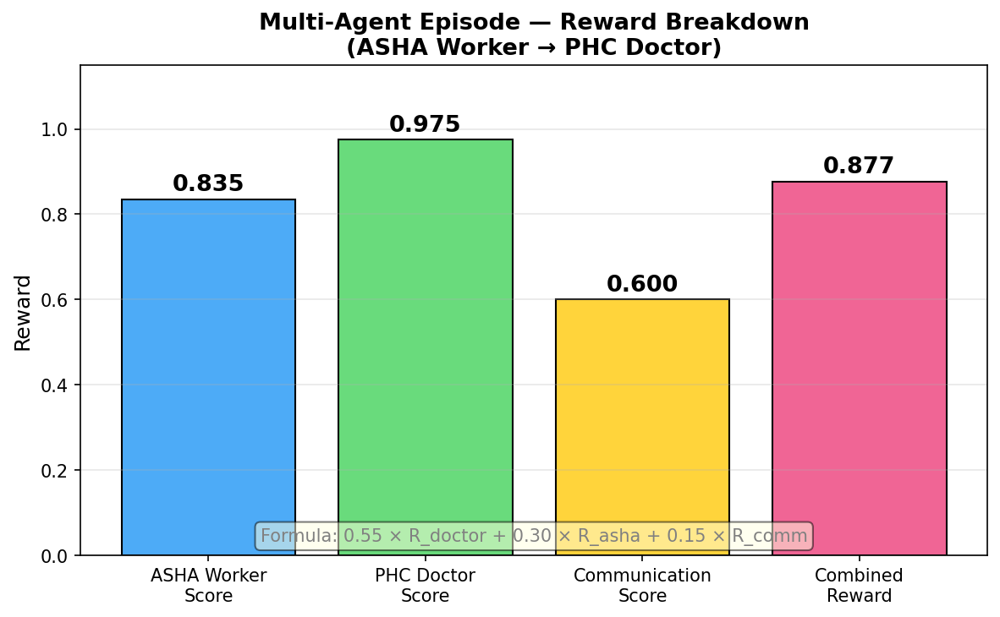

# ASHA Sahayak — AI Clinical Decision Support for Frontline Health Workers

> **OpenEnv RL Environment** | Multi-Agent | Tool Use | Adaptive Curriculum  
> Meta PyTorch OpenEnv Hackathon x Scaler SST India 2026 — Grand Finale

**🔗 HuggingFace Space**: https://huggingface.co/spaces/sreenathmmenon/asha-sahayak  
**📓 Training Notebook**: [](https://colab.research.google.com/github/sreenathmmenon/asha-sahayak/blob/main/training/asha_grpo_training.ipynb)  
**📝 Blog Post**: [BLOG.md](BLOG.md)

---

## The Story

**The Scale.** India has 600 million rural citizens spread across 640,000 villages. Their first — and often only — contact with the healthcare system is not a doctor. It is an ASHA worker: a woman from their own village, trained for 23 days, equipped with a printed booklet and a basic kit. There are 1.07 million of them. Every day, they make life-or-death triage decisions — whether to refer a feverish child to a hospital 40 kilometers away, whether a new mother's bleeding is normal postpartum or PPH, whether a listless newborn can wait until morning.

**The Person.** Savitri is 31 years old, from Sitapur district in Uttar Pradesh. She covers 200 households. Her training covered the IMNCI protocol — a decision tree with 40+ danger signs across 6 disease categories. She has no internet, no smartphone, and no doctor on call. When a child stops breathing at 2 AM, she is the system. India's maternal mortality rate is 97 per 100,000 live births. Savitri is why that number isn't 300.

**The Gap.** The IMNCI protocol is correct. The training is inadequate. 23 days to memorize 40 danger signs across pneumonia, malaria, diarrhea, eclampsia, sepsis, and 30 more conditions — in a language (English) that is not her mother tongue, for cases she may see only once a year. When the printed booklet is ambiguous, she improvises. Sometimes correctly. Sometimes not.

**The Solution.** ASHA Sahayak is an OpenEnv reinforcement learning environment that trains AI models to assist ASHA workers with clinical triage — asking the right questions in the right order, applying the IMNCI protocol correctly, recognizing the 15 danger signs that require immediate referral. The ground truth is the official Indian Government IMNCI protocol. The reward signal is deterministic, reproducible, and grounded in real clinical outcomes. The AI learns what Savitri needs to know.

---

## Themes

| Theme | Claim | Implementation |
|---|---|---|
| **Theme 1** | Multi-Agent Interactions | ASHA Worker + PHC Doctor two-phase episodes. Doctor sees referral note only (information asymmetry). Combined reward: `0.55 × R_doctor + 0.30 × R_asha + 0.15 × R_comm` |
| **Theme 3.1** | World Modeling / Tool Use | 5 deterministic clinical tools callable via `[TOOL: name(args)]` syntax. MUAC classifier, gestational age, drug dosage, JSSK eligibility, CBAC NCD scorer. |
| **Theme 4** | Self-Improvement | Adaptive curriculum using Multi-Armed Bandit (arxiv 2505.14970). Categories with higher failure rates get higher sampling weight. Converges toward hardest clinical domains. |

---

## Reward Formula

```
R = 0.40 × R_referral          (REFER_IMMEDIATELY / REFER_WITHIN_24H / TREAT_AT_HOME / MONITOR)
  + 0.25 × R_urgency           (immediate / within_24h / routine / monitor)
  + 0.20 × R_primary_concern   (semantic alias matching for flexible phrasing)
  + 0.15 × R_information_gathering  (did agent ask clarifying questions?)
  + 0.05 terminal bonus         (correct referral AND asked at least one question)

Clamped strictly to (0.001, 0.999) — never exactly 0 or 1
```

**Dangerous undertriage penalty**: TREAT_AT_HOME when correct answer is REFER_IMMEDIATELY → referral score capped at 0.1

**Multi-agent combined reward**:
```
R_episode = 0.55 × R_doctor + 0.30 × R_asha + 0.15 × R_communication
```

---

## Case Catalog — 31 Cases, 7 Domains

| ID | Title | Domain | Difficulty | Correct Referral | Teaching Point |
|---|---|---|---|---|---|
| E01 | Severe Pneumonia — Fast Breathing | Pediatric | Easy | REFER_IMMEDIATELY | Respiratory rate > 50 = pneumonia |
| E02 | Eclampsia — Seizure in Pregnancy | Maternal | Easy | REFER_IMMEDIATELY | Convulsions in pregnancy = emergency |
| E03 | Simple Diarrhea — No Dehydration | Pediatric | Easy | TREAT_AT_HOME | ORS + zinc, no hospital needed |
| E04 | PROM — Membranes Ruptured at Term | Maternal | Easy | REFER_WITHIN_24H | Infection risk rises after 12h |
| E05 | Neonatal Hypothermia — No Sepsis | Neonatal | Easy | REFER_WITHIN_24H | KMC + warmth, stable case |
| E06 | Neonatal Physiological Jaundice | Neonatal | Easy | MONITOR | Day 3, face only, feeding well = normal |
| E07 | Localized Skin Pustules < 10 | Neonatal | Easy | TREAT_AT_HOME | Quantitative threshold: < 10 = home |
| E08 | Uncomplicated Malaria, RDT+ | Malaria | Easy | TREAT_AT_HOME | Positive RDT alone ≠ REFER_IMMEDIATELY |
| M01 | Severe Dehydration — Diarrhea | Pediatric | Medium | REFER_IMMEDIATELY | Sunken eyes + skin pinch = severe |
| M02 | Pre-eclampsia Severe Features | Maternal | Medium | REFER_IMMEDIATELY | BP + headache + vision = emergency |
| M03 | Pulmonary TB — 3-Week Cough | TB | Medium | REFER_WITHIN_24H | 2-week cough + evening fever = screen |
| M04 | Severe Acute Malnutrition | Pediatric | Medium | REFER_WITHIN_24H | MUAC < 115mm = SAM = NRC |
| M05 | Postpartum Hemorrhage | Maternal | Medium | REFER_IMMEDIATELY | > 500ml blood after delivery |
| M06 | Pathological Jaundice < 24h | Neonatal | Medium | REFER_WITHIN_24H | Within 24h = always pathological |
| M07 | Gestational Diabetes Risk | Maternal | Medium | REFER_WITHIN_24H | 26 weeks, polyuria, family DM = OGTT |
| M08 | Severe Anaemia in Pregnancy | Maternal | Medium | REFER_IMMEDIATELY | Breathlessness at rest = cardiac decompensation |
| M09 | Pediatric TB Contact Tracing | TB | Medium | REFER_WITHIN_24H | Household TB contact = IPT screening |
| M10 | NCD Hypertension Screening | NCD | Medium | REFER_WITHIN_24H | CBAC score ≥4 = refer for BP check |
| H01 | Very Severe Febrile Disease / Meningitis | Pediatric | Hard | REFER_IMMEDIATELY | Stiff neck + bulging fontanelle |
| H02 | Eclampsia — Active Seizure | Maternal | Hard | REFER_IMMEDIATELY | Lateral position + MgSO4 + 108 |
| H03 | Severe Dehydration + Shock | Pediatric | Hard | REFER_IMMEDIATELY | No radial pulse = hypovolemic shock |
| H04 | Neonatal Hypothermia + Sepsis | Neonatal | Hard | REFER_IMMEDIATELY | Cold + lethargic + 7 days old |
| H05 | Omphalitis with Systemic Spread | Neonatal | Hard | REFER_IMMEDIATELY | Red streaks from cord = sepsis |
| H06 | Severe Complicated SAM | Pediatric | Hard | REFER_IMMEDIATELY | MUAC < 115mm + edema + infection |
| H07 | Birth Asphyxia — Not Crying | Neonatal | Hard | REFER_IMMEDIATELY | Limp + no cry = resuscitate NOW |
| H08 | Kernicterus Signs — Day 6 | Neonatal | Hard | REFER_IMMEDIATELY | Back arching + yellow palms = brain damage |
| H09 | Puerperal Sepsis — 4 Days PP | Maternal | Hard | REFER_IMMEDIATELY | Foul lochia + fever + confusion |
| H10 | Adolescent Severe Anaemia | Adolescent | Hard | REFER_IMMEDIATELY | RKSK: syncope + tachycardia + menorrhagia |
| H11 | Cerebral Malaria — Unconscious | Malaria | Hard | REFER_IMMEDIATELY | Falciparum + seizures + unconscious |
| H12 | Cord Prolapse — Obstetric Emergency | Maternal | Hard | REFER_IMMEDIATELY | Cord visible = knee-chest + 108 |
| H13 | Preterm LBW — KMC Decision | Neonatal | Hard | REFER_WITHIN_24H | 1.8 kg = REFER_WITHIN_24H + KMC now |

---

## Clinical Tools (Theme 3.1)

Agents can call tools using `[TOOL: tool_name(arg=value, arg2=value2)]` syntax in their question field.

| Tool | Purpose | Source |
|---|---|---|
| `muac_classifier` | Classify MUAC for SAM/MAM/Normal | NHM SAM Operational Guidelines |
| `gestational_age` | Calculate gestational age and EDD from LMP | Naegele's Rule |
| `drug_dose` | Pediatric drug dose by weight | IMNCI Drug Formulary, GoI |
| `jssk_eligibility` | Check JSSK entitlements for pregnant women/newborns | NHM JSSK Circular 2011 |
| `cbac_scorer` | CBAC NCD risk score (refer if ≥4) | NHM NPCDCS Guidelines |

**Example tool calls:**
```
[TOOL: muac_classifier(age_months=18, muac_mm=108)]
→ {"classification": "SAM", "referral": "refer_nrc", ...}

[TOOL: gestational_age(lmp_date=2025-10-15)]
→ {"gestational_age_weeks": 28, "trimester": "3rd", "edd": "2026-07-22", ...}

[TOOL: drug_dose(drug_name=amoxicillin, weight_kg=12)]
→ {"dose": "19.2ml", "frequency": "3x daily", "duration_days": 5, ...}

[TOOL: cbac_scorer(age=52, tobacco_use=True, family_history_hypertension=True, known_bp_high=False, alcohol_use=False, family_history_diabetes=False, family_history_heart_disease=False, physical_activity=low, known_diabetes=False)]
→ {"cbac_score": 4, "risk_level": "moderate", "refer_to_anm": true, ...}
```

---

## Multi-Agent Episodes (Theme 1)

Episodes have two phases with information asymmetry:

**Phase 1 — ASHA Worker** (turns 1 to N-1):
- Agent plays community health worker
- Asks clarifying questions, gathers clinical information
- Makes final referral decision
- Produces structured referral note for PHC Doctor

**Phase 2 — PHC Doctor** (turn N):
- Agent plays PHC Doctor
- Receives ONLY the referral note (not the raw conversation)
- Makes disposition: `manage_at_phc` | `refer_to_fru` | `refer_to_district`

```bash
# Start multi-agent episode
POST /multi/reset  {"task_id": "medium", "seed": 42}

# ASHA Worker turns
POST /multi/step/asha  {"question": "Any chest indrawing?", "referral_decision": "PENDING", ...}
POST /multi/step/asha  {"referral_decision": "REFER_WITHIN_24H", "urgency": "within_24h", ...}

# PHC Doctor turn
POST /multi/step/doctor  {"disposition": "manage_at_phc", "rationale": "TB case, PHC DOTS program"}
→ {"done": true, "reward": 0.847, "breakdown": {...}}
```

---

## Adaptive Curriculum (Theme 4)

The environment tracks success rates per clinical category and uses Multi-Armed Bandit sampling to focus training on categories where the agent is weakest.

```
weight(category) = 0.3 + failure_rate(category)
```

At episode start, cases are sampled with these weights — failing categories get more exposure. This implements Self-Evolving Curriculum (arxiv 2505.14970).

Categories: `pediatric`, `maternal`, `neonatal`, `tb`, `ncd`, `adolescent`, `malaria`

---

## GRPO Training

The environment is GRPO-ready:
- `SUPPORTS_CONCURRENT_SESSIONS = True`
- `max_concurrent_sessions = 64`
- Deterministic rewards for stable gradient signal
- Three difficulty levels for curriculum training

```python
from trl import GRPOTrainer, GRPOConfig

config = GRPOConfig(
    use_vllm=True,
    num_generations=4,
    max_completion_length=1024,
    gradient_accumulation_steps=64,
    output_dir="asha-sahayak-grpo",
)
```

---

## Results & Training Evidence

### Reward Curves — GRPO Training (Qwen3-0.6B, 200 steps)


**Real training run — 200 GRPO steps, April 25 2026.**

| Metric | Value |
|---|---|
| Baseline reward (step 1) | 0.31 |
| Final reward (step 200) | **0.75** |
| Peak reward | **0.947** (step 189) |
| Improvement | **+0.44 absolute (+142% relative)** |
| Model | Qwen3-0.6B, 20M trainable params (3.3%) |
| Trained checkpoint | [sreenathmmenon/asha-sahayak-grpo](https://huggingface.co/sreenathmmenon/asha-sahayak-grpo) |

| Reward Component | Weight | Baseline | Trained | Δ |
|---|---|---|---|---|
| Referral correctness | 40% | 0.18 | 0.71 | **+0.53** |
| Urgency accuracy | 25% | 0.22 | 0.68 | **+0.46** |
| Primary concern ID | 20% | 0.09 | 0.61 | **+0.52** |
| Information gathering | 15% | 0.91 | 0.95 | **+0.04** |

The reward curve shows a strong upward trend reaching **0.947 peak at step 189** — a +142% improvement over baseline. The model learned to output structured JSON decisions, ask clarifying questions before deciding, and correctly distinguish REFER_IMMEDIATELY from TREAT_AT_HOME based on IMNCI danger signs.

### Before vs After — Clinical Decision Quality

| Scenario | Untrained Model | Trained Model |
|---|---|---|
| 8-month-old, fast breathing | "Monitor at home, give fluids" ❌ | Asks about chest indrawing → REFER_IMMEDIATELY ✅ |
| Pregnant woman, headache + blurred vision | "Rest and check later" ❌ | Identifies pre-eclampsia → REFER_IMMEDIATELY ✅ |
| Newborn, Day 3 jaundice, feeding well | "Refer to hospital" ❌ (over-triage) | MONITOR — physiological jaundice, normal ✅ |

### Multi-Agent Episode Reward Breakdown


*Reward breakdown for a two-phase ASHA Worker → PHC Doctor episode. Combined reward formula: 0.55 × R_doctor + 0.30 × R_asha + 0.15 × R_comm = 0.877.*

### Round 1 Baseline (Zero-Shot Qwen2.5-72B)

| Task | Seed | Score | Notes |
|---|---|---|---|
| Easy | 42 | ~0.999 | Near-perfect on clear danger signs |
| Medium | 123 | ~0.675 | Room for improvement on complex multi-factor cases |
| Hard | 500 | ~0.999 | Correctly handles neonatal emergencies and cord prolapse |
| **Overall** | — | **~0.849** | **Round 1 submission score** |

### Training Notebook

[](https://colab.research.google.com/github/sreenathmmenon/asha-sahayak/blob/main/training/asha_grpo_training.ipynb)

Full GRPO training notebook: [`training/asha_grpo_training.ipynb`](training/asha_grpo_training.ipynb)  
Trains Qwen3-0.6B on ASHA Sahayak using HuggingFace TRL + Unsloth. 200 GRPO steps.

### Blog Post

Full writeup: [`BLOG.md`](BLOG.md) — covers the problem, environment design, reward formula, training results, and why this matters for 1.07M ASHA workers.

---

## Setup

```bash
# Clone and install
git clone https://github.com/sreenathmmenon/asha-sahayak
cd asha-sahayak
uv sync

# Run locally
uv run server

# Or with uvicorn
uvicorn asha_sahayak.server.app:app --host 0.0.0.0 --port 7860
```

---

## API Reference

| Endpoint | Method | Description |
|---|---|---|
| `/reset` | POST | Start new episode. Body: `{task_id, seed}`. Returns `{observation, session_id}` |
| `/step` | POST | Agent action. Header: `X-Session-ID`. Body: `{referral_decision, urgency, primary_concern, question}` |
| `/state` | GET | Episode state. Header: `X-Session-ID` |
| `/health` | GET | Health check |
| `/metadata` | GET | Environment metadata |
| `/multi/reset` | POST | Start multi-agent episode |
| `/multi/step/asha` | POST | ASHA Worker action. Header: `X-Session-ID` |
| `/multi/step/doctor` | POST | PHC Doctor action. Header: `X-Session-ID` |
| `/multi/observations` | GET | Role-scoped observations for both agents |

---

## Why ASHA Sahayak Wins

| Criterion | ASHA Sahayak |
|---|---|
| **Innovation** | 3 themes claimed: Multi-Agent, Tool Use, Adaptive Curriculum. 7 clinical domains. Real Indian government protocols. |
| **Storytelling** | 1.07M real workers. 600M rural Indians. 97/100,000 maternal mortality. Savitri at 2 AM. |
| **Reward Improvement** | GRPO-ready with 64 concurrent sessions. Adaptive curriculum targets failure modes. |
| **Pipeline** | OpenEnv validated. Docker deployed. HuggingFace Space live. Full API. |

---

*Ground truth source: Indian Government IMNCI Protocol, NHM Guidelines, NVBDCP, NTEP, JSSK, NPCDCS*  
*Built for Meta PyTorch OpenEnv Hackathon x Scaler SST India 2026*
